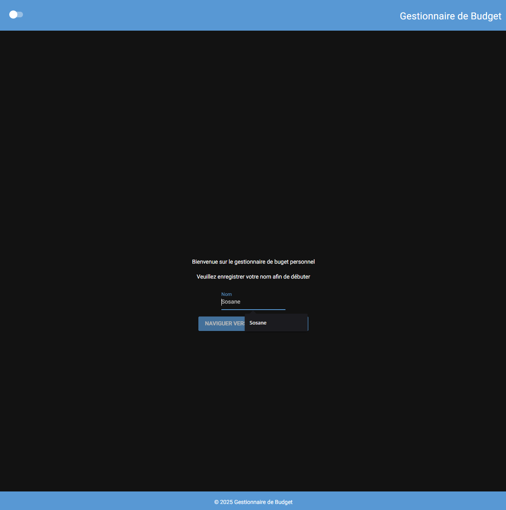
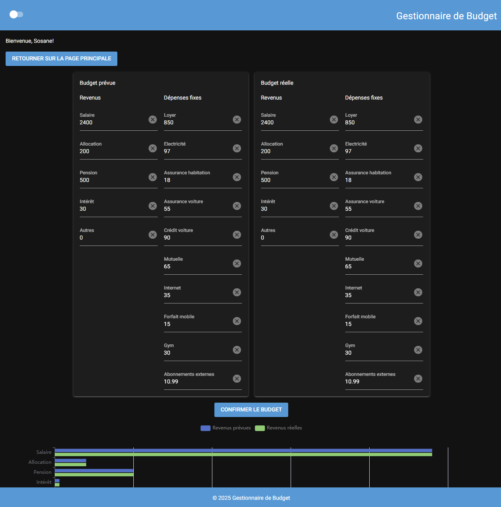

# Gestionnaire de budget personnel
Défi de création d'un gestionnaire de budget personnel

[**Consulter le gestionnaire de budget personnel ici**](https://gestionnaire-budget-personnel.onrender.com/)

---

### Exécution locale

Utilisation de la librairie [nicegui](https://pypi.org/project/nicegui/)

- Installer les dépendances nécessaires: `pip install -r requirements.txt`
- Éxecuter avec `python ./main.py`
- Voir la page sur navigateur: http://localhost:8080/

Page initiale: 
1. Formulaire budget prévue
2. Formulaire budget réelle
3. Diagrammes à bandes et circulaire
4. Toggle

(next up>)
- Relier le diagramme circulaire à `update()`.
- Statistiques des plus grandes dépenses.
- Nouvelles couleurs (changement de ui.)
- refactoring

**Documentation pour les prochaines phases:**
- https://nicegui.io/documentation/section_pages_routing#api_responses
- https://nicegui.io/documentation
- https://nicegui.io/documentation/section_page_layout
- https://nicegui.io/documentation/column
- https://nicegui.io/documentation/input#clearable
- ...