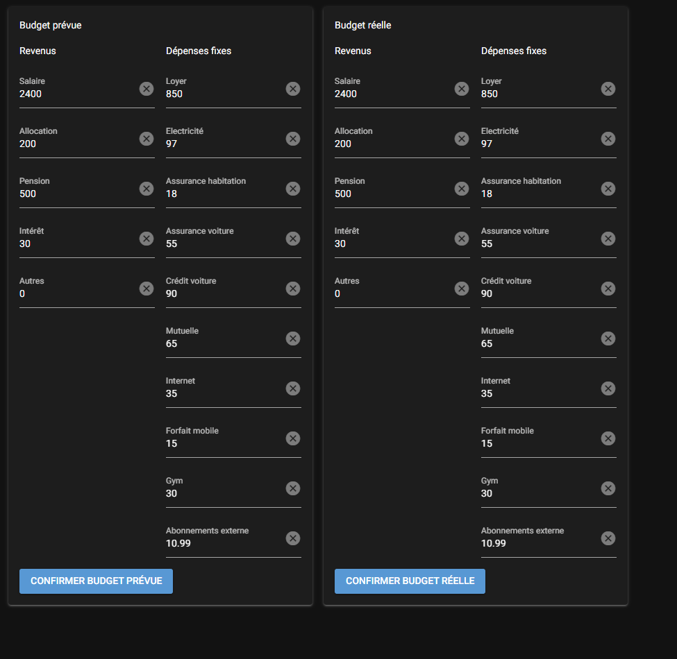

# Gestionnaire de budget personnel
Défi de création d'un gestionnaire de budget personnel

---

Utilisation de la librairie [nicegui](https://pypi.org/project/nicegui/)

- Installer `nicegui`: `pip install nicegui`
- Éxecuter avec `python ./ui/main.py`
- Voir la page sur navigateur: http://localhost:8080/

Page initiale: 
1. Formulaire budget prévue

2. Formulaire budget réelle

(next up>)
click boutton pour procéder à des calculs et afficher des graphiques (navigation). 

docs pour les prochaines phases: 
- https://nicegui.io/documentation/section_pages_routing#api_responses